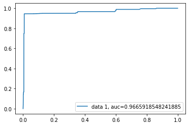
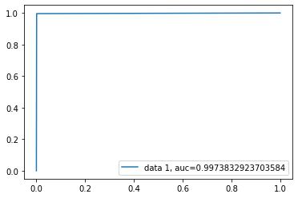
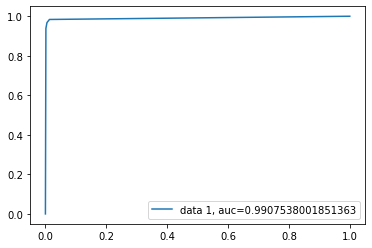

```python
import pandas as pd
import numpy as np
import matplotlib.pyplot as plt 
from sklearn.model_selection import train_test_split
import seaborn as sns 
from sklearn import preprocessing
from sklearn.linear_model import LogisticRegression
from sklearn.metrics import classification_report
from sklearn.metrics import roc_curve, roc_auc_score
from sklearn.metrics import confusion_matrix
import os # accessing directory structure
```

### Import the dataset


```python
for dirname, _, filenames in os.walk('C:\\'):
    for filename in filenames:
        print(os.path.join(dirname, filename))
```

    C:\\final-dataset.csv
    


```python
nRowsRead = None # specify 'None' if want to read whole file
# final-anormal-data-set.csv may have more rows in reality, but we are only loading/previewing the first 1000 rows
df1 = pd.read_csv('C:\\final-dataset.csv', delimiter=',', nrows = nRowsRead)
df1.dataframeName = 'final-dataset.csv'
nRow, nCol = df1.shape
print(f'There are {nRow} rows and {nCol} columns')
```

    There are 95312 rows and 83 columns
    

```python
df1.head(5)
```


<div>
<style scoped>
    .dataframe tbody tr th:only-of-type {
        vertical-align: middle;
    }

    .dataframe tbody tr th {
        vertical-align: top;
    }

    .dataframe thead th {
        text-align: right;
    }
</style>
<table border="1" class="dataframe">
  <thead>
    <tr style="text-align: right;">
      <th></th>
      <th>cpu_guest</th>
      <th>cpu_guest_nice</th>
      <th>cpu_idle</th>
      <th>cpu_iowait</th>
      <th>cpu_irq</th>
      <th>cpu_nice</th>
      <th>cpu_softirq</th>
      <th>cpu_steal</th>
      <th>cpu_system</th>
      <th>cpu_total</th>
      <th>...</th>
      <th>processcount_thread</th>
      <th>processcount_total</th>
      <th>system_hostname</th>
      <th>system_hr_name</th>
      <th>system_linux_distro</th>
      <th>system_os_name</th>
      <th>system_os_version</th>
      <th>system_platform</th>
      <th>timestamp</th>
      <th>Anormal</th>
    </tr>
  </thead>
  <tbody>
    <tr>
      <th>0</th>
      <td>0.0</td>
      <td>0.0</td>
      <td>0.0</td>
      <td>0.0</td>
      <td>0.0</td>
      <td>0.0</td>
      <td>0.0</td>
      <td>0.0</td>
      <td>5.0</td>
      <td>100.0</td>
      <td>...</td>
      <td>155.0</td>
      <td>122.0</td>
      <td>vm1-graph-analytics</td>
      <td>CentOS Linux 7.7.1908 64bit</td>
      <td>CentOS Linux 7.7.1908</td>
      <td>Linux</td>
      <td>3.10.0-1062.12.1.el7.x86_64</td>
      <td>64bit</td>
      <td>28-01-2020 19:24</td>
      <td>False</td>
    </tr>
    <tr>
      <th>1</th>
      <td>0.0</td>
      <td>0.0</td>
      <td>0.0</td>
      <td>0.0</td>
      <td>0.0</td>
      <td>0.0</td>
      <td>0.0</td>
      <td>0.0</td>
      <td>5.5</td>
      <td>100.0</td>
      <td>...</td>
      <td>155.0</td>
      <td>122.0</td>
      <td>vm1-graph-analytics</td>
      <td>CentOS Linux 7.7.1908 64bit</td>
      <td>CentOS Linux 7.7.1908</td>
      <td>Linux</td>
      <td>3.10.0-1062.12.1.el7.x86_64</td>
      <td>64bit</td>
      <td>28-01-2020 19:24</td>
      <td>False</td>
    </tr>
    <tr>
      <th>2</th>
      <td>0.0</td>
      <td>0.0</td>
      <td>0.0</td>
      <td>0.0</td>
      <td>0.0</td>
      <td>0.0</td>
      <td>0.0</td>
      <td>0.0</td>
      <td>5.5</td>
      <td>100.0</td>
      <td>...</td>
      <td>155.0</td>
      <td>122.0</td>
      <td>vm1-graph-analytics</td>
      <td>CentOS Linux 7.7.1908 64bit</td>
      <td>CentOS Linux 7.7.1908</td>
      <td>Linux</td>
      <td>3.10.0-1062.12.1.el7.x86_64</td>
      <td>64bit</td>
      <td>28-01-2020 19:24</td>
      <td>False</td>
    </tr>
    <tr>
      <th>3</th>
      <td>0.0</td>
      <td>0.0</td>
      <td>0.0</td>
      <td>0.0</td>
      <td>0.0</td>
      <td>0.0</td>
      <td>0.0</td>
      <td>0.0</td>
      <td>4.3</td>
      <td>100.0</td>
      <td>...</td>
      <td>157.0</td>
      <td>122.0</td>
      <td>vm1-graph-analytics</td>
      <td>CentOS Linux 7.7.1908 64bit</td>
      <td>CentOS Linux 7.7.1908</td>
      <td>Linux</td>
      <td>3.10.0-1062.12.1.el7.x86_64</td>
      <td>64bit</td>
      <td>28-01-2020 19:24</td>
      <td>False</td>
    </tr>
    <tr>
      <th>4</th>
      <td>0.0</td>
      <td>0.0</td>
      <td>0.0</td>
      <td>0.0</td>
      <td>0.0</td>
      <td>0.0</td>
      <td>0.0</td>
      <td>0.0</td>
      <td>5.0</td>
      <td>100.0</td>
      <td>...</td>
      <td>155.0</td>
      <td>122.0</td>
      <td>vm1-graph-analytics</td>
      <td>CentOS Linux 7.7.1908 64bit</td>
      <td>CentOS Linux 7.7.1908</td>
      <td>Linux</td>
      <td>3.10.0-1062.12.1.el7.x86_64</td>
      <td>64bit</td>
      <td>28-01-2020 19:24</td>
      <td>False</td>
    </tr>
  </tbody>
</table>
<p>5 rows × 83 columns</p>
</div>


```python
df1.info()
```

    <class 'pandas.core.frame.DataFrame'>
    RangeIndex: 95312 entries, 0 to 95311
    Data columns (total 83 columns):
     #   Column                         Non-Null Count  Dtype  
    ---  ------                         --------------  -----  
     0   cpu_guest                      95311 non-null  float64
     1   cpu_guest_nice                 95311 non-null  float64
     2   cpu_idle                       95311 non-null  float64
     3   cpu_iowait                     95310 non-null  float64
     4   cpu_irq                        95311 non-null  float64
     5   cpu_nice                       95310 non-null  float64
     6   cpu_softirq                    95310 non-null  float64
     7   cpu_steal                      95311 non-null  float64
     8   cpu_system                     95311 non-null  float64
     9   cpu_total                      95310 non-null  float64
     10  cpu_user                       95311 non-null  float64
     11  diskio_sda1_disk_name          95312 non-null  object 
     12  diskio_sda1_key                95312 non-null  object 
     13  diskio_sda1_read_bytes         95312 non-null  float64
     14  diskio_sda1_time_since_update  95312 non-null  object 
     15  diskio_sda1_write_bytes        95312 non-null  int64  
     16  diskio_sda_disk_name           95312 non-null  object 
     17  diskio_sda_key                 95312 non-null  object 
     18  diskio_sda_read_bytes          95312 non-null  float64
     19  diskio_sda_time_since_update   95312 non-null  object 
     20  diskio_sda_write_bytes         95312 non-null  int64  
     21  fs_/_device_name               95312 non-null  object 
     22  fs_/_free                      95312 non-null  int64  
     23  fs_/_fs_type                   95312 non-null  object 
     24  fs_/_key                       95312 non-null  object 
     25  fs_/_mnt_point                 95312 non-null  object 
     26  fs_/_percent                   95312 non-null  object 
     27  fs_/_size                      95312 non-null  object 
     28  fs_/_used                      95312 non-null  int64  
     29  load_cpucore                   95312 non-null  int64  
     30  load_min1                      95312 non-null  float64
     31  load_min15                     95312 non-null  float64
     32  load_min5                      95312 non-null  float64
     33  mem_active                     95312 non-null  int64  
     34  mem_available                  95312 non-null  int64  
     35  mem_buffers                    95311 non-null  float64
     36  mem_cached                     95312 non-null  int64  
     37  mem_free                       95312 non-null  int64  
     38  mem_inactive                   95312 non-null  int64  
     39  mem_percent                    95312 non-null  float64
     40  mem_shared                     95312 non-null  float64
     41  mem_total                      95311 non-null  float64
     42  mem_used                       95312 non-null  int64  
     43  memswap_free                   95312 non-null  int64  
     44  memswap_percent                95312 non-null  float64
     45  memswap_sin                    95312 non-null  int64  
     46  memswap_sout                   95312 non-null  int64  
     47  memswap_total                  95312 non-null  int64  
     48  memswap_used                   95312 non-null  int64  
     49  network_lo_cumulative_cx       95311 non-null  float64
     50  network_lo_cumulative_rx       95311 non-null  float64
     51  network_lo_cumulative_tx       95311 non-null  float64
     52  network_lo_cx                  95311 non-null  object 
     53  network_lo_interface_name      95311 non-null  object 
     54  network_lo_key                 95311 non-null  object 
     55  network_lo_rx                  95311 non-null  float64
     56  network_lo_time_since_update   95311 non-null  float64
     57  network_lo_tx                  95311 non-null  object 
     58  percpu_0_cpu_number            95312 non-null  int64  
     59  percpu_0_guest                 95312 non-null  int64  
     60  percpu_0_guest_nice            95312 non-null  int64  
     61  percpu_0_idle                  95312 non-null  float64
     62  percpu_0_iowait                95312 non-null  float64
     63  percpu_0_irq                   95312 non-null  int64  
     64  percpu_0_key                   95312 non-null  object 
     65  percpu_0_nice                  95312 non-null  float64
     66  percpu_0_softirq               95312 non-null  float64
     67  percpu_0_steal                 95312 non-null  int64  
     68  percpu_0_system                95312 non-null  float64
     69  percpu_0_total                 95312 non-null  float64
     70  percpu_0_user                  95312 non-null  float64
     71  processcount_running           95311 non-null  float64
     72  processcount_sleeping          95311 non-null  float64
     73  processcount_thread            95311 non-null  float64
     74  processcount_total             95311 non-null  float64
     75  system_hostname                95312 non-null  object 
     76  system_hr_name                 95312 non-null  object 
     77  system_linux_distro            95312 non-null  object 
     78  system_os_name                 95312 non-null  object 
     79  system_os_version              95312 non-null  object 
     80  system_platform                95312 non-null  object 
     81  timestamp                      95312 non-null  object 
     82  Anormal                        95312 non-null  bool   
    dtypes: bool(1), float64(37), int64(21), object(24)
    memory usage: 59.7+ MB
    

### Clear the dataset and normalise


```python
df1 = df1.select_dtypes(exclude=['object'])
df1 =df1[~df1.isin([np.nan, np.inf, -np.inf]).any(1)]
df1["Anormal"] = df1["Anormal"].astype(int)
```


```python
df1.info()
```

    <class 'pandas.core.frame.DataFrame'>
    Int64Index: 95310 entries, 0 to 95311
    Data columns (total 59 columns):
     #   Column                        Non-Null Count  Dtype  
    ---  ------                        --------------  -----  
     0   cpu_guest                     95310 non-null  float64
     1   cpu_guest_nice                95310 non-null  float64
     2   cpu_idle                      95310 non-null  float64
     3   cpu_iowait                    95310 non-null  float64
     4   cpu_irq                       95310 non-null  float64
     5   cpu_nice                      95310 non-null  float64
     6   cpu_softirq                   95310 non-null  float64
     7   cpu_steal                     95310 non-null  float64
     8   cpu_system                    95310 non-null  float64
     9   cpu_total                     95310 non-null  float64
     10  cpu_user                      95310 non-null  float64
     11  diskio_sda1_read_bytes        95310 non-null  float64
     12  diskio_sda1_write_bytes       95310 non-null  int64  
     13  diskio_sda_read_bytes         95310 non-null  float64
     14  diskio_sda_write_bytes        95310 non-null  int64  
     15  fs_/_free                     95310 non-null  int64  
     16  fs_/_used                     95310 non-null  int64  
     17  load_cpucore                  95310 non-null  int64  
     18  load_min1                     95310 non-null  float64
     19  load_min15                    95310 non-null  float64
     20  load_min5                     95310 non-null  float64
     21  mem_active                    95310 non-null  int64  
     22  mem_available                 95310 non-null  int64  
     23  mem_buffers                   95310 non-null  float64
     24  mem_cached                    95310 non-null  int64  
     25  mem_free                      95310 non-null  int64  
     26  mem_inactive                  95310 non-null  int64  
     27  mem_percent                   95310 non-null  float64
     28  mem_shared                    95310 non-null  float64
     29  mem_total                     95310 non-null  float64
     30  mem_used                      95310 non-null  int64  
     31  memswap_free                  95310 non-null  int64  
     32  memswap_percent               95310 non-null  float64
     33  memswap_sin                   95310 non-null  int64  
     34  memswap_sout                  95310 non-null  int64  
     35  memswap_total                 95310 non-null  int64  
     36  memswap_used                  95310 non-null  int64  
     37  network_lo_cumulative_cx      95310 non-null  float64
     38  network_lo_cumulative_rx      95310 non-null  float64
     39  network_lo_cumulative_tx      95310 non-null  float64
     40  network_lo_rx                 95310 non-null  float64
     41  network_lo_time_since_update  95310 non-null  float64
     42  percpu_0_cpu_number           95310 non-null  int64  
     43  percpu_0_guest                95310 non-null  int64  
     44  percpu_0_guest_nice           95310 non-null  int64  
     45  percpu_0_idle                 95310 non-null  float64
     46  percpu_0_iowait               95310 non-null  float64
     47  percpu_0_irq                  95310 non-null  int64  
     48  percpu_0_nice                 95310 non-null  float64
     49  percpu_0_softirq              95310 non-null  float64
     50  percpu_0_steal                95310 non-null  int64  
     51  percpu_0_system               95310 non-null  float64
     52  percpu_0_total                95310 non-null  float64
     53  percpu_0_user                 95310 non-null  float64
     54  processcount_running          95310 non-null  float64
     55  processcount_sleeping         95310 non-null  float64
     56  processcount_thread           95310 non-null  float64
     57  processcount_total            95310 non-null  float64
     58  Anormal                       95310 non-null  int32  
    dtypes: float64(37), int32(1), int64(21)
    memory usage: 43.3 MB
    


```python
list(df1.columns)
```


    ['cpu_guest',
     'cpu_guest_nice',
     'cpu_idle',
     'cpu_iowait',
     'cpu_irq',
     'cpu_nice',
     'cpu_softirq',
     'cpu_steal',
     'cpu_system',
     'cpu_total',
     'cpu_user',
     'diskio_sda1_read_bytes',
     'diskio_sda1_write_bytes',
     'diskio_sda_read_bytes',
     'diskio_sda_write_bytes',
     'fs_/_free',
     'fs_/_used',
     'load_cpucore',
     'load_min1',
     'load_min15',
     'load_min5',
     'mem_active',
     'mem_available',
     'mem_buffers',
     'mem_cached',
     'mem_free',
     'mem_inactive',
     'mem_percent',
     'mem_shared',
     'mem_total',
     'mem_used',
     'memswap_free',
     'memswap_percent',
     'memswap_sin',
     'memswap_sout',
     'memswap_total',
     'memswap_used',
     'network_lo_cumulative_cx',
     'network_lo_cumulative_rx',
     'network_lo_cumulative_tx',
     'network_lo_rx',
     'network_lo_time_since_update',
     'percpu_0_cpu_number',
     'percpu_0_guest',
     'percpu_0_guest_nice',
     'percpu_0_idle',
     'percpu_0_iowait',
     'percpu_0_irq',
     'percpu_0_nice',
     'percpu_0_softirq',
     'percpu_0_steal',
     'percpu_0_system',
     'percpu_0_total',
     'percpu_0_user',
     'processcount_running',
     'processcount_sleeping',
     'processcount_thread',
     'processcount_total',
     'Anormal']


### Split the dataset into feature and target set


```python
X = df1.copy()
X.drop(list(X.filter(regex = 'mem_')), axis = 1, inplace = True)
X.drop(list(X.filter(regex = 'memswap')), axis = 1, inplace = True)
X = X.loc[:, X.columns != 'Anormal']
y = df1["Anormal"].astype(int)
```


```python
list(X.columns)
```


    ['cpu_guest',
     'cpu_guest_nice',
     'cpu_idle',
     'cpu_iowait',
     'cpu_irq',
     'cpu_nice',
     'cpu_softirq',
     'cpu_steal',
     'cpu_system',
     'cpu_total',
     'cpu_user',
     'diskio_sda1_read_bytes',
     'diskio_sda1_write_bytes',
     'diskio_sda_read_bytes',
     'diskio_sda_write_bytes',
     'fs_/_free',
     'fs_/_used',
     'load_cpucore',
     'load_min1',
     'load_min15',
     'load_min5',
     'network_lo_cumulative_cx',
     'network_lo_cumulative_rx',
     'network_lo_cumulative_tx',
     'network_lo_rx',
     'network_lo_time_since_update',
     'percpu_0_cpu_number',
     'percpu_0_guest',
     'percpu_0_guest_nice',
     'percpu_0_idle',
     'percpu_0_iowait',
     'percpu_0_irq',
     'percpu_0_nice',
     'percpu_0_softirq',
     'percpu_0_steal',
     'percpu_0_system',
     'percpu_0_total',
     'percpu_0_user',
     'processcount_running',
     'processcount_sleeping',
     'processcount_thread',
     'processcount_total']


### Using Logistic Regression Classifier


```python
from sklearn.model_selection import train_test_split
X_train,X_test,y_train,y_test=train_test_split(X,y,test_size=0.25,random_state=0)
```


```python
# import the class
from sklearn.linear_model import LogisticRegression

# instantiate the model (using the default parameters)
logreg = LogisticRegression()

# fit the model with data
logreg.fit(X_train,y_train)

#
y_pred=logreg.predict(X_test)
```


```python
# import the metrics class
from sklearn.metrics import classification_report, confusion_matrix
cnf_matrix = metrics.confusion_matrix(y_test, y_pred)
cnf_matrix
```


    array([[20105,   104],
           [ 1937,  1682]], dtype=int64)


```python
print(classification_report(y_test, y_pred))
```

                  precision    recall  f1-score   support
    
               0       0.91      0.99      0.95     20209
               1       0.94      0.46      0.62      3619
    
        accuracy                           0.91     23828
       macro avg       0.93      0.73      0.79     23828
    weighted avg       0.92      0.91      0.90     23828
    
    


```python
y_pred_proba = logreg.predict_proba(X_test)[::,1]
fpr, tpr, _ = metrics.roc_curve(y_test,  y_pred_proba)
auc = metrics.roc_auc_score(y_test, y_pred_proba)
plt.plot(fpr,tpr,label="data 1, auc="+str(auc))
plt.legend(loc=4)
plt.show()
```





### Using Decision Tree Classifier


```python
from sklearn.tree import DecisionTreeClassifier
dtc = DecisionTreeClassifier()
dtc.fit(X_train, y_train)
```


    DecisionTreeClassifier()


```python
y_pred = dtc.predict(X_test)
```


```python

print(confusion_matrix(y_test, y_pred))
print(classification_report(y_test, y_pred))
```

    [[20187    22]
     [   15  3604]]
                  precision    recall  f1-score   support
    
               0       1.00      1.00      1.00     20209
               1       0.99      1.00      0.99      3619
    
        accuracy                           1.00     23828
       macro avg       1.00      1.00      1.00     23828
    weighted avg       1.00      1.00      1.00     23828
    
    


```python
y_pred_proba = dtc.predict_proba(X_test)[::,1]
fpr, tpr, _ = metrics.roc_curve(y_test,  y_pred_proba)
auc = metrics.roc_auc_score(y_test, y_pred_proba)
plt.plot(fpr,tpr,label="data 1, auc="+str(auc))
plt.legend(loc=4)
plt.show()
```





### Using KNN Classifier


```python
# Import module for KNN
from sklearn.neighbors import KNeighborsClassifier
# Create KNN instance
# n_neighbors -> argument identifies the amount of neighbors used to ID classification
knn = KNeighborsClassifier(n_neighbors=3)
# Fit (i.e. traing) the model
knn.fit(X_train, y_train)
```


    KNeighborsClassifier(n_neighbors=3)


```python
# Use the .predict() method to make predictions from the X_test subset
y_pred = knn.predict(X_test)
cnf_matrix = metrics.confusion_matrix(y_test, y_pred)
cnf_matrix
```


    array([[20105,   104],
           [  116,  3503]], dtype=int64)


```python
print(confusion_matrix(y_test, y_pred))
print(classification_report(y_test, y_pred))
```

    [[20105   104]
     [  116  3503]]
                  precision    recall  f1-score   support
    
               0       0.99      0.99      0.99     20209
               1       0.97      0.97      0.97      3619
    
        accuracy                           0.99     23828
       macro avg       0.98      0.98      0.98     23828
    weighted avg       0.99      0.99      0.99     23828
    
    


```python
y_pred_proba = knn.predict_proba(X_test)[::,1]
fpr, tpr, _ = metrics.roc_curve(y_test,  y_pred_proba)
auc = metrics.roc_auc_score(y_test, y_pred_proba)
plt.plot(fpr,tpr,label="data 1, auc="+str(auc))
plt.legend(loc=4)
plt.show()
```





```python

```
